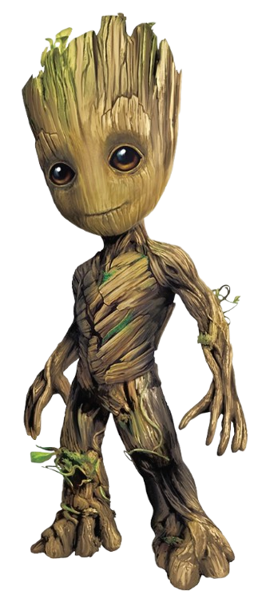

<!-- _class: title -->

# Árvores
## Algoritmos e Estruturas de Dados


---

<!-- _class: agenda -->

- Motivação
-  Árvores
-  Falsas Árvores
-  Definições (Super) Importantes
-  Revisão e Considerações


---


<!-- _class: chapter -->

<!--  -->

# Motivação

---

# Árvores




As **árvores** são, sem dúvida, uma das estruturas de dados mais fascinantes e poderosas da computação. 

Embora, à primeira vista, possam parecer complexas, elas estão no coração de inúmeros sistemas que usamos todos os dias.

---

# Árvores


Pense em como o sistema de arquivos do seu computador organiza **pastas e arquivos**, ou como os bancos de dados otimizam a **busca por informações**, ou até mesmo como os compiladores de código processam as **linguagens de programação**. Em todos esses cenários, a estrutura por trás é uma árvore.


---

# Árvores

Neste primeira unidade do curso, vamos mergulhar no mundo das árvores para entender como elas funcionam e por que são tão eficientes.
            
O objetivo é compreender a lógica por trás de sua **estrutura hierárquica** e como essa hierarquia nos permite resolver problemas de forma muito mais elegante e rápida do que com estruturas lineares, como listas e vetores, vistas na disciplina anterior.
      


---

# Árvores


Prepare-se para explorar conceitos como **nó**, **raíz**, **folha** e as diferentes formas de **travessia** que nos permitem visitar cada elemento de uma árvore. 

Ao final, você não apenas terá uma nova ferramenta em seu arsenal de programação, mas também uma nova perspectiva sobre a organização e a busca de dados. Vamos começar nossa jornada pela base dessas estruturas e construir nosso conhecimento, nó por nó.


---

<!-- _class: chapter -->

# Árvores

---

# Definição


<div class="beamer-block">
  <h3 class="beamer-block-title">Árvore</h3>
  <div class="beamer-block-content">
    <p>A árvore é uma <b>estrutura de dados hierarquizada</b>, geralmente não <b>linear</b>. É composta por uma <b>coleção de nós conectados por arestas</b>. Cada nó pode possuir uma <b>chave</b> que o identifica.</p>
  </div>
</div>

Vamos ver uma exemplo!

---

# Representação

Se um nó **X está conectado com um nó Y** (há uma aresta no sentido de X para Y), dizemos que **X é um nó pai** e **Y um nó filho**. 

Se dois nós possuem o mesmo pai, eles são ditos **irmãos**. **Um nó só pode ter no máximo um pai**.





---

# Representação

No exemplo ao lado, o nó com chave **C** é pai do nó com chave **H**. Além disso, os nós com chaves **I** e **J** são irmãos. O nó raiz, cuja chave é **A**, não possui pai.


---

# Exemplo

O DOM (Document Object Model) é um dos melhores exemplos de uma estrutura de árvore em programação, especificamente no desenvolvimento web. Ele é a representação em forma de árvore de um documento HTML (ou XML) que é criada pelo navegador. 

Essa representação em árvore permite que linguagens de programação, principalmente o Javascript, interajam com o conteúdo de uma página web. É como se o Javascript usasse o DOM como um mapa detalhado da página para encontrar e manipular qualquer elemento. 

---

# Exemplo

```HTML
<!DOCTYPE html>
<html>
<head></head>
  <body>
    <h1>Olá, Mundo!</h1>
    <p id="pgrafo">Este é um parágrafo.</p>
  </body>
</html>
```

Dessa forma, você pode usar _Javascript_ para mudar o texto do parágrafo, adicionar ou remover um elemento à página. Tudo isso de forma dinâmica, sem precisar recarregar a página inteira.




---

# Lembrete


<div class="beamer-alert-block">
  <h3 class="beamer-block-title">Nota</h3>
  <div class="beamer-block-content">
<ul>
<li> A raiz é o nó que não possui pai. Ela é única.
<li> As folhas, ou nós terminais, não possem filhos.
<li> Os demais nós são chamados de intermediários ou internos
</ul>
  </div>
</div>


---

<!-- _class: chapter -->

# Falsas Árvores

---

# Exemplo 1.1

<!-- _class: multicolumn -->




Nota-se que o nó com chave **C** possui dois pais (**A** e **D**) e isso não é permitido.

---


# Exemplo 1.2

<!-- _class: multicolumn -->




Neste exemplo, temos mesmo problema de dois pais (nó com chave **C**). Mas também temos duas raízes (**A** e **G**).

---

# Exemplo 1.3

<!-- _class: multicolumn -->





Este caso é interessante, pois todos os nós possuem um pai. Ou seja, não existe raiz e isso não é permitido. A única árvore sem raiz é a árvore vazia que indicaremos com um círculo tracejado. 

---

<!-- _class: chapter -->

# Definições (Super) Importantes

---

## Árvore T




---

# Subárvore


<div class="beamer-block">
  <h3 class="beamer-block-title">Definição</h3>
  <div class="beamer-block-content">
Uma <b>subárvore</b> consiste em uma porção interconectada da árvore. Qualquer nó juntamente com seus descendentes constituem uma subárvore.
  </div>
</div>

Os nós destacados em T (**B**, **D** e **E**) formam um subárvore de T. Trata-se de uma miniárvore dentro da árvore original. A subárvore possui sua própria raiz, folhas e nós internos.
  
Note que uma árvore pode ser considerada uma subárvore de si mesma.

---

# Tamanho

<div class="beamer-block">
  <h3 class="beamer-block-title">Definição</h3>
  <div class="beamer-block-content">
O <b>tamanho</b> da árvore é definido como o número total de nós.
  </div>
</div>


O tamanho de T é 15, pois possui 15 nós: 
  - Uma raiz (**A**),
  - Seis folhas (**F**, **K**, **L**, **M**, **N** e **O**) e 
  - Oito nós internos (**B**, **C**, **D**, **E**, **G**, **H**, **I** e **J**) . 

---

# Altura


<div class="beamer-block">
  <h3 class="beamer-block-title">Definição</h3>
  <div class="beamer-block-content">
 A <b>altura</b> da árvore é o comprimento do caminho mais longo da raiz até as folhas. 
  </div>
</div>

 A altura de T é 4. O comprimento pode ser calculado como o número de arestas da raiz até a folha mais distante. Há quatro arestas de **A** até **K**, por exemplo.

A altura pode ser calculada para qualquer nó, já que ele e todos os descendentes são considerados uma (sub)árvore. Geralmente se considera a altura de uma árvore vazia como zero. 

---

# Profundidade

<div class="beamer-block">
  <h3 class="beamer-block-title">Definição</h3>
  <div class="beamer-block-content">
A <b>profundidade</b> de um nó é o número de arestas no caminho da raiz até esse nó.
  </div>
</div>

 
A profundidade do nó **J** é 3, pois há três arestas da raiz até **J**. Note que a profundidade da folha mais baixa é igual a altura da árvore.

A profundidade de um nó indica qual nível da árvore ele pertence. A raiz possui nível 0, o filhos da raiz nível 1, os netos da raiz nível 2 e assim sucessivamente. É fácil concluir que a altura está relacionada ao número de níveis. 

---

# Altura x Profundidade

<!-- _class: multicolumn -->



Considerando o nó com chave **G**, sua altura é a distância até a folha mais baixa (arestas verdes). Já sua profundidade, é a distância da raiz até **G** (arestas azuis).  

---

# Grau

<div class="beamer-block">
  <h3 class="beamer-block-title">Definição</h3>
  <div class="beamer-block-content">
O <b>grau</b> de um nó é o número de filhos que ele possui.
  </div>
</div>
 
 Na árvore T, o nó **B** tem grau 2. Já os nós **H** e **F** possuem grau 1 e 0, respectivamente. 

---

# Nomenclatura 

Quanto ao número de filhos, uma árvore onde todos os nós possuem somente um filho se comporta como uma lista. Se os nós possuem no máximo dois filhos, a árvore é chamada de **binária**. Se três filhos, chama-se **ternária** e assim por diante. Uma árvore em que os nós possuem no máximo $n$ filhos é chamada de **$n$-ária**.

---

<!-- _class: chapter -->

# Revisão e Considerações

---

# Resumo

Nesta seção, estudamos a estrutura de dados árvore do forma generalizada. Em particular, estudamos:

> - O que é uma árvore e seus componentes (raiz, nó, folha etc);
> - Altura;
> - Profundidade;
> - Tamanho;
> - Grau;
> - Subárvore.


---

# Considerações


Todos esses conceitos são **fundamentais** e, portanto, devemos estar bem familiarizados com eles. No estudo das árvores como estruturas de dados, é imprescindível dominar as definições de **altura**, **profundidade**, **subárvore**, **grau** e **tamanho**.

No próximo capítulo da nossa jornada, iremos estudar um tipo especial de **árvore** chamada **binária**. 

---

<!-- _class: end -->

# Obrigado

**Prof. Dr. Bruno Xavier**

Centro Multidisciplinar de Pau dos Ferros
Departamento de Engenharias e Tecnologia
Algoritmos e Estruturas de Dados 2

