<!-- _class: title -->

# Árvore AVL
## Algoritmos e Estruturas de Dados

---

<!-- _class: agenda -->

-  Definição
-  Fator de Balanceamento
-  Rotações
-  Revisão e Considerações

---

<!-- _class: chapter -->

# Definição

---

# Motivação

Um dos problemas das BSTs são que elas pode ficar desbalanceadas, no pior caso, degeneradas. A árvore AVL busca remover esse problema rebalanceado a árvore sem perder as propriedades de uma BST.

---
# Definição

  <h3 class="beamer-block-title">AVL</h3>
  

Uma árvore AVL (Adelson-Velsky e Landis) é uma árvore binária de busca (BST) que é balanceada, ou seja, a altura de cada nó difere em no máximo uma unidade entre suas subárvores esquerda e direita. 
  

Isso garante que operações como inserção, remoção e busca sejam eficientes, com uma complexidade de tempo de O(log n).

---

<!-- _class: chapter -->

# Fator de Balanceamento

---

# Definição

  <h3 class="beamer-block-title">Fator de Balanceamento</h3>
  

O <strong>fator de balanceamento</strong> (fb) de um nó é a diferença entre as alturas de suas subárvores esquerda e direita. Um nó com fator de balanceamento de -1, 0 ou +1 é considerado balanceado. 
  

Para calcular o fator, basta fazer a diferença entre a quantidade de níveis da subárvore esquerda e a quantidade de níveis da subárvore direta. O fator de balanceamento das folhas é sempre zero.

---

# Significado

Os valores do fb nos dizem o estado de balanceamento de um nó:

- <mark>fb = 0</mark>: A subárvore esquerda e a subárvore direita têm a mesma altura. O nó está perfeitamente balanceado.
- <mark>fb = +1</mark>: A subárvore esquerda é uma aresta mais alta que a subárvore direita. O nó está balanceado, mas com uma leve inclinação para a esquerda.
- <mark>fb = -1</mark>: A subárvore direita é uma aresta mais alta que a subárvore esquerda. O nó está balanceado, mas com uma leve inclinação para a direita.

Em qualquer outro caso, será necessário um rebalanceamento.

---

# Exemplo

Neste exemplo, cada nó, além da chave, possui o fator de balanceamento. Onde não há indicação significa que o fb é zero.
Como todos os nós estão com fator de balanceamento dentro do limite permitido ([-1,1]), esta árvore é AVL.

 

---

# Exemplo

Neste caso, temos o nó com chave 8 desbalanceado. Além dele, a raiz também está desbalanceada. Por essa razão, a árvore ilustrada não é AVL.

 

---

<!-- _class: chapter -->

# Rotações

---

# Rotação

Para manter o balanceamento, a árvore AVL realiza operações de **rotação**. Elas são necessárias após inserções ou remoções para redistribuir os nós e garantir que o balanceamento seja preservado. 	

---

# Rotação

- **Inserção/Remoção**:
    - Após esta operação, a árvore AVL verifica o fator de balanceamento dos nós afetados.
- **Rotação**:
    - Se um nó tiver um fator de balanceamento fora do intervalo aceitável (-1 a 1), uma rotação é realizada para restabelecer o balanceamento.
- **Atualização**:
    - A altura e o fator de balanceamento de todos os nós afetados pela rotação são atualizados.

---

# Tipos de Rotações

As rotações podem ser divididas em **simples** ou **duplas**, além da direção **esquerda** ou **direita**. Como fb é a diferença entra as alturas das subárvores esquerda e direita, se

- fb > 1: deve-se rotacionar para a direita;
- fb < 1: deve-se rotacionar para a esquerda;

Sobre se a rotação é simples ou dupla, é necessário verificar o sinal do fb do filho.

---

<!-- _class: chapter -->

# Rotações Simples

---

# Rotação à Direita

Considere que fb(B) > 1. Além disso, fb(A) $\geq$ 0.

---

# Exemplo

Claramente, o nó **C** está desbalanceado com um fator igual a +2. É necessário que seja realizada uma rotação para a direita. Desse modo, o nó **B** funciona como um pivô.

---

# Exemplo

---

# Exemplo

Claramente, o nó **A** está desbalanceado com um fator igual a +2. É necessário que seja realizada uma rotação para a direita. Como **A** deve se tornar filho da direita de **B**, devemos realocar **D** como filho da esquerda de **A**.

---

# Exemplo

---

# Rotação à Esquerda
A rotação à esquerda é dual à direta.

---

# Exemplo

- Qual nó está desbalanceado?
- Qual rotação deve ser aplicada?
- Qual a árvore resultante dessa operação?

---

# Exemplo

---

# Nota

Você irá perceber que, teoricamente, só precisamos de uma rotação. Primeiro, porque as rotações à esquerda e direita são espelhadas. Segundo, como você notará, as rotações duplas pode ser divididas em simples.

Uma rotação dupla à esquerda, por exemplo, não significa duas rotações à esquerda, mas uma para a direita na subárvore seguida de uma para a esquerda. Todavia, para diminuir o número de operações, podemos fazer tudo em um passo só.

---

<!-- _class: chapter -->

# Rotações Duplas

---

# Rotação à Direita

Em dois passos. Rotação para a esquerda em **B**, depois para a direita em **A**.

---

# Rotação à Direita

Em um único passo. Considere fb(A) > 1 e fb(B) < 0.

---

# Rotação à Esquerda

Em dois passos. Rotação para a direita em **B**, depois para a esquerda em **A**.
 

---

Em um único passo. Considere fb(A) < -1 e fb(B) > 0

# Rotação à Esquerda

---

<!-- _class: chapter -->

# Revisão e Considerações

---

# Resumo

Nesta aula, estudamos a estrutura de dados árvore AVL.

> - Definimos essa estrutura baseada em BST;
> - Definimos o fator de balanceamento de um nó;
> - Estudamos as rotações
>   - Simples (Esquerda e Direita)
>   - Dupla (Esquerda e Direita)

Na próxima aula, iremos abordar as operações de inserção, busca e remoção em AVL e como as rotações são aplicadas nessas operações.

---

 # Considerações

A árvore **AVL** é uma estrutura otimizada além da BST. Ela supera a possibilidade de degeneração da árvore efetuando operações de rotação. Embora essas rotações exijam mais computações, o ganho com o rebalanceamento é maior, principalmente para buscas. 

No nosso próximo estudo, iremos abordar a aplicação das rotações durante as inserções e remoções de nós na árvore.

---

<!-- _class: end -->

# Obrigado

**Prof. Dr. Bruno Xavier**

Centro Multidisciplinar de Pau dos Ferros
Departamento de Engenharias e Tecnologia
Algoritmos e Estruturas de Dados 2

