<!-- _class: chapter -->

# Operações

---

# Inserção

A operação de inserir um nó segue a mesma regra de uma BST. Porém, após recalcular as alturas do nós, se necessário, devemos aplicar as rotações precisamente.

1. Insira o novo elemento na árvore AVL como se fosse uma BST.
2. Suba a árvore a partir do nó inserido até a raiz, atualizando os fbs. 
3. Se o fb de um nó for $\pm2$, então a árvore está desbalanceada naquele nó.

---

# Aplicação de Rotação

Suponha que fb de **A** seja maior que 1.
- R(LL): Se o fb do filho esquerdo for **positivo** ou **zero**, é necessária uma Rotação Simples à Direita em **A**.
- R(LR): Se o fb do filho esquerdo for **negativo**, é necessária uma Rotação Dupla à Direita em **A**.

---

# Aplicação de Rotação

Suponha que fb de **A** seja menor que -1.
- R(RR): Se o fb do filho direito for **negativo** ou **zero**, é necessária uma Rotação Simples à Esquerda em **A**.
- R(RL): Se o fb do filho direito for **positivo**, é necessária uma Rotação Dupla à Esquerda em **A**.

---

# Aplicação de Rotação

 Após a rotação, o balanceamento é restaurado. Pode ser necessário continuar verificando e balanceando os nós superiores, dependendo do desbalanceamento inicial. 

---

# Exemplo

Inserir 1, 2, 3, 10, 4, 5, 9, 7, 8 e 6 em uma AVL vazia.

---

# Exemplo

Rotação 

---

# Exemplo

[10, 4, 5, 9, 7, 8, 6]

---

# Exemplo

Rotação 

---

# Exemplo

[5, 9, 7, 8, 6]

---

# Exemplo

Rotação 

---

# Exemplo

[9, 7, 8, 6]

---

# Exemplo

Rotação 

---

# Exemplo

[7, 8, 6]

---

# Exemplo

Rotação

---

# Exemplo

[6]

---

# Exemplo

Rotação

---