<!-- _class: title -->

# Questões Objetivas
## Algoritmos e Estruturas de Dados

---

# Exercício 1.1
Em uma estrutura de dados do tipo árvore não orientada, o grau do nó raiz refere-se
 
a) ao número de filhos que o nó possui.
b) ao maior caminho do nó para a folha mais distante. 
c) à profundidade do nó. 
d) ao maior caminho do nó para a folha mais próxima. 
e) ao menor caminho do nó para a folha mais distante.

---

# Exercício 1.2

A complexidade de busca em uma árvore binária balanceada é

a) $O(1)$
b) $O(n)$ 
c) $O(n\,log\,n)$ 
d) $O(log\,n)$ 
e) $O(log\,n^2)$

---

# Exercício 1.3
Em uma árvore binária de busca, qual é a condição que cada nó deve satisfazer?

a) O nó da esquerda deve ser maior que o nó da direita.
b) Todos os nós devem ter exatamente dois filhos. 
c) O nó da esquerda deve ser menor ou igual ao nó pai, e o nó da direita deve ser maior que o nó pai.
d) A árvore deve ser balanceada. 

---

# Exercício 1.4
Considere a seguinte árvore binária de busca ao lado. Qual é a sequência dos nós visitados na travessia pós-ordem desta árvore?

 
 a) 10, 7, 6, 9, 15, 21, 18, 23, 27.
 b) 6, 9, 7, 18, 23, 27, 21, 15, 10. 
 c) 6, 9, 7, 18, 27, 23, 21, 15, 10.
 d) 10, 15, 21, 23, 27, 18, 7, 6, 9. 

---

# Exercício 1.5
Em uma BST, a afirmação que é verdadeira para todos os nós é
 
 a) os nós à esquerda de um nó contêm valores maiores que o valor do nó.
 b) os nós à direita de um nó contêm valores menores que o valor do nó.
 c) o nó raiz sempre tem o menor valor na árvore.
 d) os nós à esquerda de um nó contêm valores menores ou iguais ao valor do nó, e todos os nós à direita contêm valores maiores ou iguais ao valor do nó.
 e) os nós à esquerda de um nó contêm valores menores que o valor do nó, e todos os nós à direita contêm valores maiores que o valor do nó 

---

# Exercício 1.6
Sobre as árvores, no contexto de estrutura de dados, analise as afirmativas. 
 
 I. Árvores são estruturas de dados lineares. 
 II. Em uma árvore cada nó pode ter no máximo dois filhos. 
 III. Nós que não possuem filhos são chamados de Folhas. 
 
 Está correto o que se afirma em
 

 a) I, apenas.   
 b) II, apenas.
 c) III, apenas.
 d) I e III, apenas.
 e) I, II e III.

---

# Exercício 1.7

Árvores binárias de busca (BST) garantem a eficiência de inserções e buscas em tempo O (log n), desde que a árvore esteja balanceada, o que mantém a estrutura equilibrada e otimiza a altura da árvore.  

 a) Certo.
 b) Errado.

---

# Exercício 1.8

Seja T uma árvore binária completa com n nós e altura h. O valor de n que indica uma árvore cheia é 
 
 a) $n = 2^{h}$
 b) $n = 2^{h-1}$
 c) $n = 2^{h+1}$
 d) $n = 2^{h-1}-1$
 e) $n = 2^{h+1}-1$

---

# Gabarito

1.1. A
1.2. D
1.3. C
1.4. C
1.5. E
1.6. C
1.7. A
1.8. E

---

<!-- _class: end -->

# Parabéns

**Prof. Dr. Bruno Xavier**

Centro Multidisciplinar de Pau dos Ferros
Departamento de Engenharias e Tecnologia
Algoritmos e Estruturas de Dados 2

