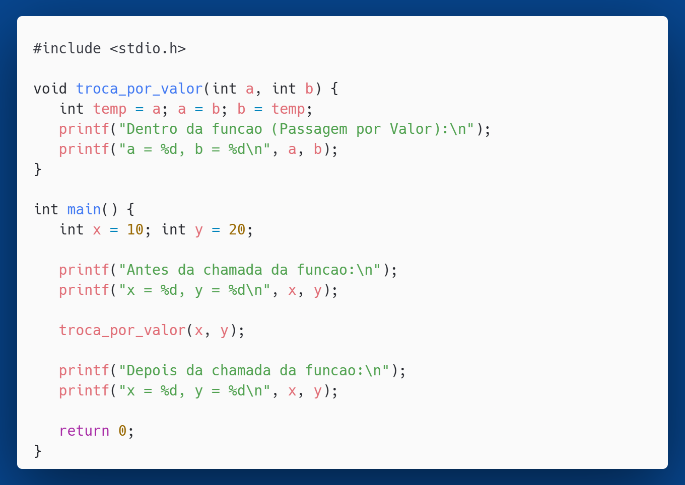

<!-- _class: title -->

# Trilha de Exercícios
## Algoritmos e Estruturas de Dados

---

<!-- _class: chapter -->

# Árvores

---

# Exercício 2.1
Classifique as árvores a-f quanto ao número de filho e calcule:
- O tamanho da árvore
- A altura de cada nó
- O grau de cada nó
- A profundidade de cada nó

---

# Exercício 2.1 (a)

---

# Exercício 2.1 (b)

---

# Exercício 2.1 (c)

---

# Exercício 2.1 (d)

---

# Exercício 2.1 (e)

---

# Exercício 2.1 (f)

---

# Exercício 2.2 

Defina a altura de uma árvore em termos de níveis.

---

# Exercício 2.3
Em relação às árvores cheia, perfeita e completa:

a) Qual delas implica em outra? Por exemplo, árvores cheias são também completas? E as completas são cheias? 

b) O que dizer das cheias e das perfeitas? E sobre as perfeitas e as completas?

---

<!-- _class: chapter -->

# BST 

---

# Exercício 2.4
Insira, na sequência dada, as chaves a seguir em uma BST vazia

a) [10, 5, 15, 3, 7, 12, 18]
b) [2, 5, 8, 12, 15, 20]
c) [25, 20, 15, 10, 5]
d) [20, 10, 30, 5, 15, 25, 35, 12]
e) [10, 5, 20, 3, 7, 15, 30, 18, 25, 35]

Cada sequência corresponde a uma árvore. Em seguida, classifique as árvores em cheia, completa, perfeita e degenerada.

---

# Exercício 2.5
Determine os percursos em pré-ordem, ordem e pós-ordem das árvores obtidas no exercício anterior.

---

# Exercício 2.6
Se você tivesse a tarefa de implementar um BST que permitisse chaves duplicadas, como você trataria elas?

---

# Exercício 2.7
Dada a BST abaixo

Determine a árvore após a remoção dos nós 49, 22, 81, 34, 92 e 52

---

<!-- _class: chapter -->

# AVL

---

# Exercício 2.8
Qual a relação entre BST e AVL? Ou seja, o que elas tem em comum e o que as diferenciam.

---

# Exercício 2.9
Seja T uma árvore do tipo AVL vazia. Supondo que os elementos 5, 10, 12, 8, 7, 11 e 13 sejam inseridos nessa ordem em T, qual a sequência que corresponde a um percurso de T em pré-ordem?

---

# Exercício 2.10

Seja T uma árvore do tipo AVL vazia. Supondo que os elementos 5, 10, 12, 8, 7, 11 e 13 sejam inseridos nessa ordem em T, qual a sequência que corresponde a um percurso de T em pré-ordem?

---

# Exercício 2.11
Seja uma árvore do tipo AVL vazia, insira os elementos: 10, 20, 30, 40, 50, 25, 60, 70, 80 e 90. Lembre-se de realizar as rotações necessárias.

---

# Exercício 2.12
Seja uma árvore do tipo AVL vazia, insira os elementos: 40, 20, 10, 30, 25, 60, 45, 42, 52, 50, 55, 75, 70, 80 e 85. Lembre-se de realizar as rotações necessárias.

---

# Exercício 2.13

Suponha que um programa constrói uma BST de palavras, usando a ordem do dicionário para decidir em qual ramo a palavra deve ser armazenada. Desenhe quatro árvores, uma para cada uma das seguintes ordens de entrada de palavras:

a) nice food roam dodge gate office wave
b) wave roam office nice gate food dodge
c) food dodge roam wave office gate nice 
d) nice roam office food wave gate dodge

Como ficaria cada uma das árvores depois que a palavra 'food' fosse removida? 

---

# Exercício 2.14
Refaça o exercício anterior considerando uma AVL ao invés de uma BST.

---

<!-- _class: chapter -->

# Programação

---

# Exercício 2.15
Pesquise e disserte sobre a **sobrecarga de recursão** (ou _recursion overhead_).

---

# Exercício 2.16

Compile e execute o código a seguir. Observe a saída.

Após executar o programa, responda às seguintes perguntas:

a) A função `troca_por_valor` realmente trocou os valores de `a` e `b`? O que aconteceu com os valores de `x` e `y` no `main` depois que a função terminou?

b) Explique em suas próprias palavras por que a função não conseguiu trocar os valores de `x` e `y`. Qual conceito de passagem de parâmetros em C está em jogo aqui?

---

# Exercício 2.16

---

# Exercício 2.17

a) Modifique o programa do exercício anterior para que a função realmente troque os valores das variáveis `x` e `y` no `main`. Para fazer isso, você terá que usar **ponteiros** e o conceito de **passagem por referência**.

Sua nova função deve ter esta assinatura:
`void troca_por_referencia(int* a, int* b);`

b) Responda em que tipo de situação a passagem por referência é indispensável.

---

# Exercício 2.18

Você foi encarregado de escrever um função para apagar uma árvore liberando a memória alocada para cada nó. Qual estratégia você abordaria para que nenhum nó fosse esquecido e porquê?

---

<!-- _class: end -->

# Parabéns

**Prof. Dr. Bruno Xavier**

Centro Multidisciplinar de Pau dos Ferros
Departamento de Engenharias e Tecnologia
Algoritmos e Estruturas de Dados 2
