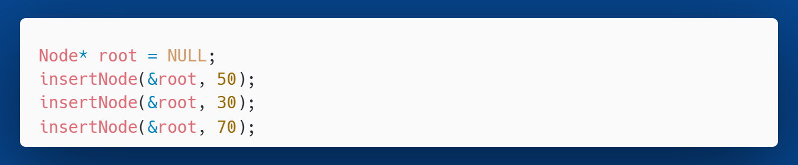

<!-- _class: title -->

# Desafios de Programação
## Algoritmos e Estruturas de Dados

---

# Exercício 3.1

a) Encontre o elemento com a menor chave de uma BST data.

b) Encontre o sucessor em ordem de um elemento em uma BST data.

---

# Exercício 3.2

a) Escreva uma função que deve retornar o tamanho de uma árvore binária.

b) Escreva uma função que deve retornar a altura de uma árvore binária.

---

# Exercício 3.3

a) Implemente um método para remover o nó com a menor chave de uma BST. 

b) Dada uma BST, realiza a mudança de uma chave.

---

# Exercício 3.4

a) Dada uma BST, encontre a mediana das chaves de todos os nós.

b) Dada uma árvore binária, cheque se ela é ou não uma BST.

---

# Exercício 3.5

Implemente uma função de inserção em uma BST que não seja recursiva, ou seja, uma versão iterativa (com `for` ou `while`).

---

# Exercício 3.6

Implemente uma função de inserção em uma BST que simule a passagem por referência. Em miúdos, sua função deve ter a seguinte assinatura:
 
 `void insertNode (Node** node, int key)`

Ou seja, `insertNode` não possui retorno, mas deve atualizar `node` (a árvore passada como parâmetro) internamente.
Exemplo de uso:

---

# Exercício 3.7

Implemente as travessias estudadas (pré-ordem, ordem e pós-ordem). Faça testes com árvores conhecidas neste material. As funções devem ter as seguintes assinaturas:

---

# Exercício 3.8

Implemente uma função de busca em uma BST que não seja recursiva, ou seja, uma versão iterativa (com `for` ou `while`).

---

# Exercício 3.9

Escreva uma função `traverse` que terá como parâmetros uma árvore, uma flag (`PRE`, `IN` ou `POS`) que determinará o percurso em pré-ordem, ordem ou pós-ordem e um ponteiro para uma função. A função `traverse` deverá retornar o percurso correspondente da árvore.

---

# Exercício 3.10

A sugestão é usar `switch-case` sobre `ord` para implementar a lógica de qual percurso acionar. Em cada caso do `switch` você deve implementar a travessia corresponde usando a própria função recursivamente e a função `visit` para processar o nó. Exemplo de uso:

---

# Exercício 3.11

Escreva um programa que abra e leia um arquivo de texto e registre quantas vezes cada palavra ocorre no arquivo. Use uma  BST modificada para armazenar tanto uma palavra quanto o número de vezes que ela ocorre. Depois que o programa tiver lido o arquivo, ele deve oferecer um menu com três opções. A primeira é listar todas as palavras junto com o número de ocorrências. A segunda é permitir que você digite uma palavra, com o programa relatando quantas vezes a palavra ocorreu no arquivo. A terceira opção é sair.

---

# Exercício 3.11

O nó da árvore precisará de três campos:
- `char* word`: Um ponteiro para a palavra.
- `int count`: Um contador para o número de ocorrências.
- `Node* left`, `Node* right`: Ponteiros para os nós filhos.

---

# Exercício 3.11

O fluxo principal do programa seria:

1. **Abrir o arquivo:** Use `fopen` para abrir o arquivo de texto em modo de leitura (`"r"`).
    
2. **Ler e processar o arquivo:**
    - Leia o arquivo palavra por palavra.
    - Para cada palavra, use uma função de inserção na BST:
        - Se a palavra já existir na árvore, **apenas incremente o contador** (`count`) do nó correspondente.
        - Se a palavra não existir, **adicione um novo nó** à árvore com o contador inicializado em 1.

---

# Exercício 3.11

3. **Apresentar o menu:** Depois de ler todo o arquivo, entre em um loop que exibe as três opções e espera pela escolha do usuário.
    
4. **Executar as opções:**
    
    - **Opção 1 (Listar tudo):** Use uma travessia em ordem na BST.Para cada nó, imprima a palavra e sua contagem.
        
    - **Opção 2 (Buscar palavra):** Crie uma função de busca na BST. Se o nó for encontrado, imprima a contagem. Caso contrário, informe que a palavra não foi encontrada.
        
    - **Opção 3 (Sair):** Saia do loop e termine o programa. Lembre-se de liberar toda a memória alocada para a árvore.

---

<!-- _class: end -->

# Parabéns

**Prof. Dr. Bruno Xavier**

Centro Multidisciplinar de Pau dos Ferros
Departamento de Engenharias e Tecnologia
Algoritmos e Estruturas de Dados 2
