<!-- _class: title -->

# Árvore Binária
## Algoritmos e Estruturas de Dados


---

<!-- _class: agenda -->

-  Definição
-  Propriedades
-  Falsas Árvores
-  Definições (Super) Importantes
-  Revisão e Considerações

---

<!-- _class: chapter -->

# Definição

---

# Definição


<div class="beamer-block">
  <h3 class="beamer-block-title">Árvore Binária</h3>
  <div class="beamer-block-content">
    A árvore binária é uma árvore onde os nós possuem no <b>máximo dois filhos</b>. Portanto, um nó qualquer pode possuir 0, 1 ou 2 filhos.
  </div>
</div>


---


# Exemplos




---

<!-- _class: chapter -->

# Propriedades

---

# Propriedades das Árvore Binárias

Um árvore binária de altura $h$ tem no máximo $2^{h+1} - 1$ nós


Um árvore binária com $n$ nós tem uma altura mínima de $\lceil log_{2}(n + 1)\rceil - 1$


Um árvore binária com $n$ nós tem no máxima $\lceil n/2\rceil$ nós terminais

---

# Exemplo 1

 Uma árvore de altura 4 possuirá, no máximo,  $2^{4+1}-1=2^{5}-1=31$ nós.

---

# Exemplo 2

 Se uma árvore binária possui 7 nós, então sua altura mínima será de 
 
 $$\lceil log_{2}(7 + 1)\rceil - 1=\lceil log_{2}8\rceil - 1=\lceil 3\rceil - 1=2$$

> Além disso, tal árvore possuirá no máximo $\lceil 7/2\rceil$ nós terminais, ou seja, $4$ folhas.

---

<!-- _class: chapter -->

# Classificação

---

# Classificação


Uma árvore binária pode ser classificada em 
- **Cheia**, 
- **Completa**, 
- **Perfeita** ou 
- **Degenerada**, 

dependendo do arranjo de seus nós. 


---

# Árvore Binária Cheia

Cada nó possui zero ou dois filhos (**nunca exatamente um**). Na árvore ao lado, nenhum nó possui somente um filho. Portanto, ela é cheia.



---

# Árvore Binária Completa

Neste caso, todos os níveis, acima das folhas do último nível, estão preenchidos integralmente.


A árvore acima possui 3 níveis, onde os níveis 0, 1 e 2 estão completos. 

---

# Árvore Binária Perfeita

É uma árvore binária em todos os níveis estão completamente preenchidos.


Todos os nós internos têm dois filhos e todas as folhas estão no mesmo nível. 


---

# Observação


Mais a frente, estudaremos o balanceamento das árvores. Por hora, vale destacar a **árvore degenerada** que é aquela em que cada nó tem no máximo um filho. Isso faz com que a árvore se assemelhe a uma **lista encadeada**.

---

# Questionamento

Um pergunta importante seria: **como podemos visitar todos os nós, sem exceção, de uma árvore somente uma vez?** Para isso, devemos estudar os percursos que podemos fazer em uma árvore.

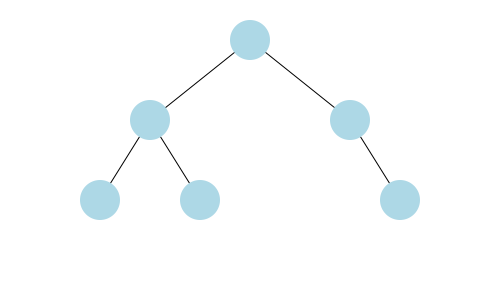


---

<!-- _class: chapter -->

# Percursos

---

# Definição

<div class="beamer-block">
  <h3 class="beamer-block-title">Percurso</h3>
  <div class="beamer-block-content">
    Um <b>percurso</b>, ou <b>travessia</b>, diz respeito ao modo de como percorremos uma árvore. Percorrer uma árvore binária envolve <b>visitar todos os seus nós</b> em uma <b>ordem específica</b> para realizar várias operações, como pesquisar, classificar ou modificar a árvore.
  </div>
</div>


As estratégias de travessia são amplamente classificadas em:

- Percurso em Largura
- Percurso em Profundidade

---

# Percurso em Largura

O **percurso em largura** visita os nós em cada nível, da esquerda para a direita, antes de prosseguir para o próximo. Essa abordagem é ideal quando todos os nós em um nível precisam ser processados antes de passar para o próximo.

---

# Exemplo



Um percurso em largura resultará na sequência **A**, **B**, **C**, **D** e **E**. 

- No nível 0, passamos por **A**;
- No nível 1, passamos por **B** e **C**;
- No nível 2, passamos por **D** e **E**;

---

# Percurso em Profundidade

O **percurso em profundidade** explora o mais profundamente possível em cada ramo antes de retroceder. Esta categoria inclui os subtipos:

- **pré-ordem**: nó, esquerda, direita
- **ordem**: esquerda, nó, direita 
- **pós-ordem**: esquerda, direita, nó

---

# Pré-ordem

<div class="beamers-block">
  <h3 class="beamer-block-title">Pré-Ordem</h3>
  <div class="beamer-block-content">
Cada nó é processado antes de seus filhos. Segue a seguinte ordem de visita: raiz, subárvore esquerda, subárvore direita.
  </div>
</div>

<br />
(raiz ➡️ esquerda ➡️ direita)

---

# Exemplo

 
Processamos a raiz (**A**) e vamos para a subárvore esquerda. Processamos a nova raiz (**B**). Não temos subárvores de **B**, então voltamos e analisamos a subárvore direita de **A**. Processamos a nova raiz (**C**). 

---

# Ordem

<div class="beamers-block">
  <h3 class="beamer-block-title">Ordem</h3>
  <div class="beamer-block-content">
Processa a subárvore esquerda, o nó atual e, em seguida, a subárvore direita.
  </div>
</div>

<br />
esquerda ➡️ raiz ➡️ direita

---

# Exemplo


Vamos para a subárvore esquerda. Processamos a nova raiz (**B**). Voltamos para a raiz e processamos (**A**). Vamos para a subárvore direita. Processamos a nova raiz (**C**). 

---

# Pós-ordem

<div class="beamers-block">
  <h3 class="beamer-block-title">Pós-Ordem</h3>
  <div class="beamer-block-content">
Acessa o nó atual após suas subárvores. Segue a seguinte ordem de visita: subárvore esquerda, subárvore direita e raiz.
  </div>
</div>

<br />
esquerda ➡️ direita ➡️ raiz

---

# Exemplo


Vamos para a subárvore esquerda. Processamos a nova raiz (**B**). Vamos para a subárvore direita. Processamos a nova raiz (**C**). Voltamos para a raiz e processamos (**A**). 

---

# Fixação


**Largura**: A, B, C, D, E, F 

---

# Fixação


**Pré-ordem** (Nó, Esquerda, Direta): A, B, D, E, C, F

---

# Fixação


**Ordem** (Esquerda, Nó, Direta): D, B, E, A, C, F

---

# Fixação


**Pós-ordem** (Esquerda, Direta, Nó): D, E, B, F, C, A

---

# Digreção

Parece complicado, mas com bastante prática e um pouco de artifício visual podemos estabelecer um método simples para determinar essas sequências. 

Em sala de aula, estabelecemos um método fácil e rápido de encontrar a travessia, além de estudarmos o que acontece na memória _stack_ quando a função é chamada recursivamente.

Agora, vamos partir para a implementação.

---

<!-- _class: chapter -->

# Implementação

---

# Estrutura Nó

Para criarmos uma árvore binária em C, devemos criar uma nova estrutura. Tal estrutura deve conter o valor da chave e dois ponteiros para indicar os filhos do lado esquerdo e direito. 

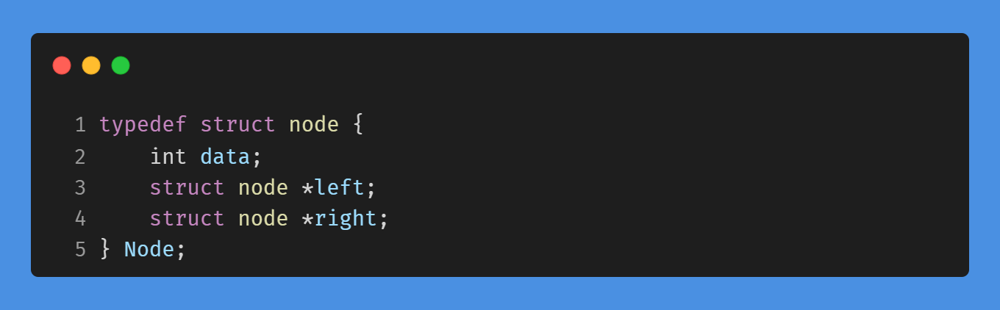


<!-- >```C data-noscale
typedef struct node {
	int data;
	struct node *left;
	struct node *right;
} Node;
``` -->


---

# Criando um Nó


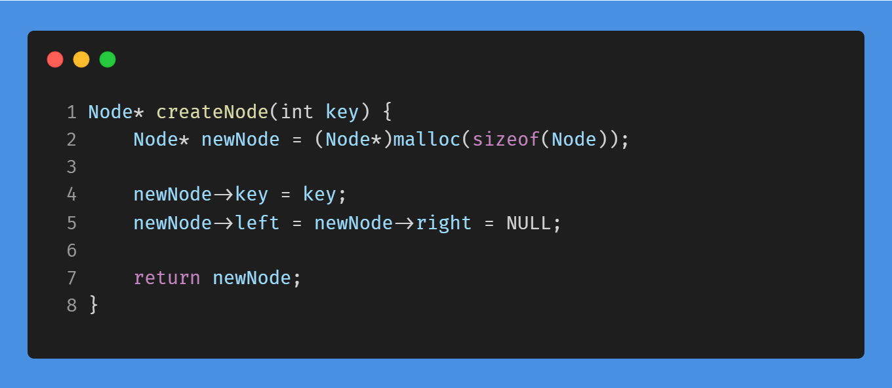

<!-- ```C [1]
Node* createNode(int key) { 
    Node* newNode = (Node*)malloc(sizeof(Node));
    
    newNode->key = key;
    newNode->left = newNode->right = NULL;
    
    return newNode;
}
 ```--->


➡️ A função `createNode` recebe uma chave inteira e retorna um ponteiro para um objeto do tipo `Node`.

---

# Alocando Memória


➡️ Na segunda linha, estamos alocando memória para o novo nó. Para isso, `sizeof(Node)` calcula o tamanho em bytes da estrutura `Node`.  A função `malloc` retorna um ponteiro genérico, por isso fazemos um _casting_ para `Node*`.

<!--```C [2] class="big-code"
Node* createNode(int key) { 
    Node* newNode = (Node*)malloc(sizeof(Node));
    
    newNode->key = key;
    newNode->left = newNode->right = NULL;
    
    return newNode;
}
 ```-->

---

# Inicialização


➡️ Em seguida, preenchemos os campos do nó `newNode`: a chave e os filhos. No caso, o novo nó não possui filhos, então recebem o valor `NULL`. 


<!--```C [4-5]
Node* createNode(int key) { 
    Node* newNode = (Node*)malloc(sizeof(Node));
    
    newNode->key = key;
    newNode->left = newNode->right = NULL;
    
    return newNode;
}
 ```-->

---

# Criando uma árvore

Na função principal (`main`), podemos fazer a inserção da seguinte forma:

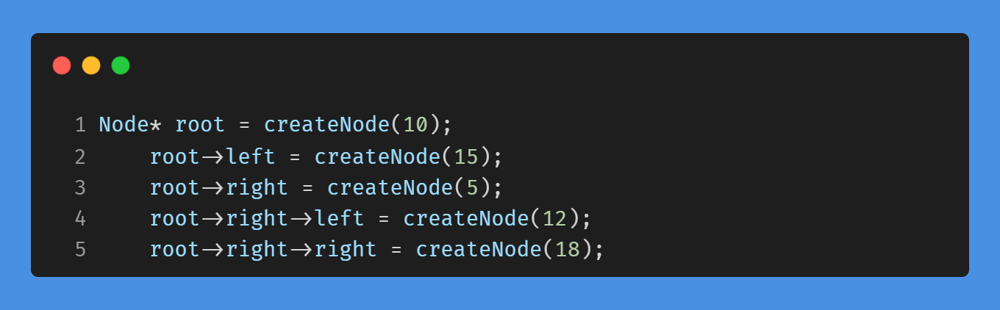

<!-- ```C
Node* root = createNode(10);
    root->left = createNode(5);
    root->right = createNode(15);
    root->right->left = createNode(12);
    root->right->right = createNode(18);
``` -->

---

# Resultado

O código anterior representaria a seguinte árvore:


---
# Percursos

Os percusos são implementados recursivamente da seguinte forma:

- **Pré-ordem**: visita nó, processa esquerda, processa direita;
- **Ordem**: processa esquerda, visita nó, processa direita;
- **Pos-ordem**: processa esquerda, processa direita, visita nó;

---

# Percursos

<!-- _class: multicolumn -->


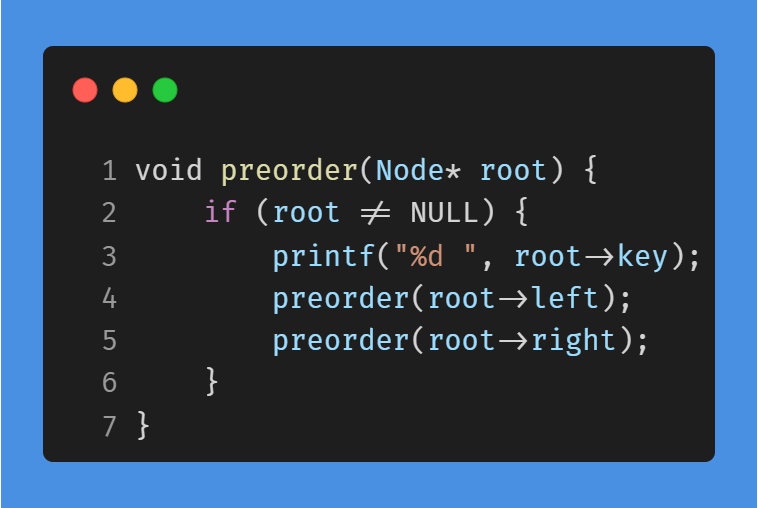

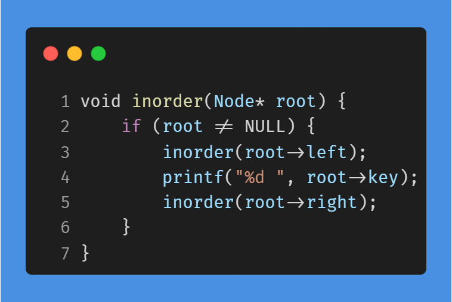

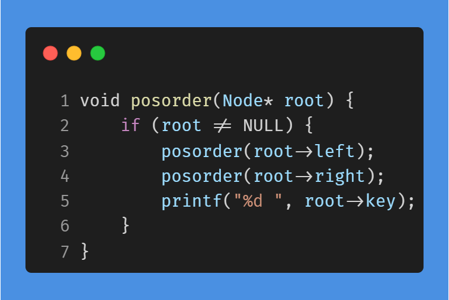


---

# Percursos

Na pasta `code`, você pode encontrar a implementação no arquivo `arvorebinaria.c`. Desse modo, você pode criar árvores diversas e verificar as travessias implementadas.

No nosso exemplo anterior, o programa deve gerar a saída:

```c
Pre-Ordem:  10 15 5 12 18
Ordem:      15 10 12 5 18
Pos-Ordem:  15 12 18 5 10
```

---

<!-- _class: chapter -->

# Revisão e Considerações

---

# Resumo

Nesta seção, estudamos a estrutura de dados árvore binária.

> - Definimos essa estrutura;
> - Classificamos as árvores binárias;
>   - Cheia, completa e perfeita;
> - Realizamos percursos diversos;
>   - Largura e profundidade;

Quanto ao percurso em profundidade, abordamos as travessias em pré-ordem, ordem e pós-ordem.

---

 # Considerações


Agora que estamos familiarizados com os conceitos fundamentais da estrutura de dados árvore, iremos estudar um tipo especial de árvore binária chamada **árvore binária de busca**.

Procure dominar os percursos realizando os exercícios propostos deste capítulo.   

---


<!-- _class: end -->

# Obrigado

**Prof. Dr. Bruno Xavier**

Centro Multidisciplinar de Pau dos Ferros
Departamento de Engenharias e Tecnologia
Algoritmos e Estruturas de Dados 2