<!-- _class: title -->

# Árvore Binária de Busca
## Algoritmos e Estruturas de Dados


---

<!-- _class: agenda -->

-  Definição
-  Operações
-  Implementação
-  Complexidades
-  Revisão e Considerações

---

<!-- _class: chapter -->

# Definição

---

# Motivação

A Árvore Binária de Busca (ABB ou BST, do inglês), possui a característica de ser **otimizada para busca**. Ela distribui seus nós com uma regra básica baseada na grandeza de **ordem de suas chaves**. Por essa razão, iremos adotar chaves com valores inteiros que podem ser facilmente comparados.

---

# Exemplo

Observe a árvore binária ao lado.


Todos os nós à esquerda (em azul) da raiz possuem chaves menores que a chave da raiz. Além disso, todos os nós à direita (em vermelho) da raiz possuem chaves maiores que a chave da raiz.  

---

# Exemplo


Tal característica se estende para qualquer nó da árvore. Por exemplo, o nó cuja chave é **3**, todos os nós à esquerda possem chaves menores que **3** (chave **1**) e na direita as maiores que **3** (chaves **6**, **4** e **7**).

---

# Definição

<div class="beamer-block">
  <h3 class="beamer-block-title">Árvore Binária de Busca</h3>
  <div class="beamer-block-content">
Uma árvore binária de busca (BST) é uma árvore binária que obedece a seguinte regra: dado um nó com chave <b>A</b>, todo nó à esquerda possui chave <b>menor que A</b> e todo nó à direita possui chave <b>maior que A</b>.
  </div>
</div>

Algumas BSTs permitem chaves duplicadas, no entanto vamos abordar o caso em que todas as chaves são diferentes.

As operações básicas sobre as BSTs são inserção, busca e remoção.

---

<!-- _class: chapter -->

# Operações

---

# Inserção

A inserção em uma BST ocorre nas folhas. A operação deve manter a característica da regra geral. Para isso, devemos compara as chaves para decidir se caminhamos para a esquerda ou direita.

 No exemplo a seguir, vamos inserir as chaves 15, 10, 20, 8, 12, 17 e 25 em uma BST vazia.

---

# Exemplo

[15, 10, 20, 8, 12, 17, 25]


Como a árvore está incialmente vazia, a chave 15 se torna a raiz.

---

# Exemplo

[15, 10, 20, 8, 12, 17, 25]


Sabe-se que 10 é menor que 15, portanto deve ser adicionado à esquerda.

---

# Exemplo

[15, 10, 20, 8, 12, 17, 25]


 Neste caso, 20 é maior que 15, portanto deve ser adicionado à direita.
 

---

# Exemplo

[15, 10, 20, 8, 12, 17, 25]


Para adicionar o 8, comparamos com a raiz. Logo devemos ir para à esquerda. Em seguida comparamos com o 10, indicando que será adicionada à esquerda.


---

# Exemplo

[15, 10, 20, 8, 12, 17, 25]


 De modo semelhante, 12 é menor que 15, seguimos para esquerda da raiz.
 Depois, 12 é maior que 10, então seguimos para a direita. 


---

# Exemplo


[15, 10, 20, 8, 12, 17, 25]


Para adicionar a chave 17, seguimos para a direita, pois 17 > 15. Depois para a esquerda, pois 17 < 20.


---

# Exemplo

[15, 10, 20, 8, 12, 17, 25]


Seguindo o mesmo raciocínio, a chave 25 deve ser alocada à direta de 20.

---

# Busca

A busca ocorre percorrendo a árvore conforme a regra geral. Iniciando da raiz, percorremos os nós seguindo um caminho da direita ou esquerda conforma o valor da chave. Se a chave procurada é maior que a chave do nó atual, buscamos na direita, caso contrário na esquerda.  

---

# Exemplo

Veja um exemplo da busca pelo chave 12:


Iniciamos pela raiz e comparamos os valores (12 < 15). devemos seguir para a esquerda. Comparamos as chaves (12 > 10). Devemos ir para a direita. Comparamos as chaves (12 = 12). Busca concluída, elemento encontrado.

---

# Exemplo

Agora, vamos buscar o nó com chave 18:


Iniciamos pela raiz e comparamos os valores (18 > 15). devemos seguir para a direita. Comparamos as chaves (18 < 10). Devemos ir para a esquerda. Comparamos as chaves (18 > 17). Devemos ir para a esquerda, porém não temos mais nós para percorrer. Busca concluída, elemento não encontrado. 

---

# Remoção

A remoção de um nó em uma BST requer alguns cuidados, uma vez que não podemos quebrar a regra geral. Para tanto, devemos analisar três casos: 

- O nó a ser removido é uma **folha**: retire da árvore sem compaixão.
- O nó a ser removido possui somente **um filho**: o filho substitui o pai.
- O nó a ser removido possui **dois filhos**: o nó é substituído pelo seu sucessor em ordem ou predecessor. O sucessor/predecessor é removido.

---

# Exemplo


 Caso 1, o nó não possui filhos, basta apagá-lo.

---

# Exemplo

Caso 2, o filho substitui o pai.

---

# Exemplo


 Caso 3, trocamos o nó pelo seu predecessor na árvore. 


---

# Observação

<div class="beamer-alert-block">
  <h3 class="beamer-block-title">Nota</h3>
  <div class="beamer-block-content">
O predecessor é o nó com a maior chave na subárvore esquerda. Já o antecessor é o nó com menor chave na subárvore direita. Note que após as remoções a árvore continuou obedecendo a regra geral ("menores de um lado, maiores do outro").
  </div>
</div>

---

<!-- _class: chapter -->

# Implementação

---

# Inserção 

Existem várias implementações do algoritmo de inserção em BST. Abaixo, uma implementação recursiva.


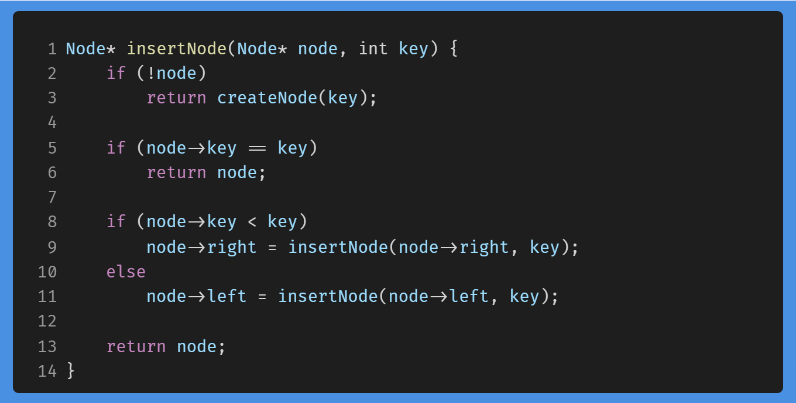


<!--
```C
Node* insertNode(Node* node, int key) {
	if (!node)
	    return createNode(key);
    
	if (node->key == key)
	    return node;
    
	if (node->key < key)
	    node->right = insertNode(node->right, key);
	else
	    node->left = insertNode(node->left, key);

    return node;
}
```
-->

---

# Inserção 


O ``if`` na linha 5 foi usado para descartar chaves que já foram inseridas. Outras implementações podem permitir duplicatas.

---

# Inserção 


 O ``if`` da linha 2 é onde ocorre a inserção propriamente dita. 
 
---

# Inserção 


 
 O ``if-else`` da linha 8 é onde ocorre o caminho (para esquerda ou direita) que deve-se seguir para adicionar o novo nó.

 ---

# Inserção 


Para gerar a subárvore em azul da árvore do início deste capítulo, podemos fazer na `main()`:


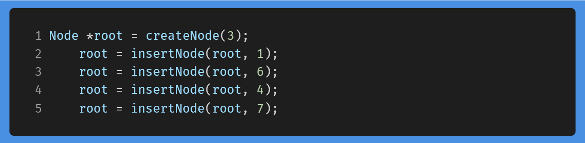

<!--```c
Node *root = createNode(3);
	root = insertNode(root, 1);
	root = insertNode(root, 6);
	root = insertNode(root, 4);
	root = insertNode(root, 7);
```-->

---

# Observação

Vale notar que estamos passando `Node* node` para a função `insertNode`. Isso indica que não estamos atualizando a árvore original, mas criando uma nova e reatribuindo. **Pesquise sobre passagem de parâmetros por valor e por referência em C**.    

Você pode determinar os percursos dessa subárvore com papel e lápis e depois conferir com as implementações.

---

# Busca


<!--```C
Node* searchNode(Node* root, int key)
{
    if (root == NULL || root->key == key)
        return root;

    if (root->key < key)
        return searchNode(root->right, key);

    return searchNode(root->left, key);
}
``` -->

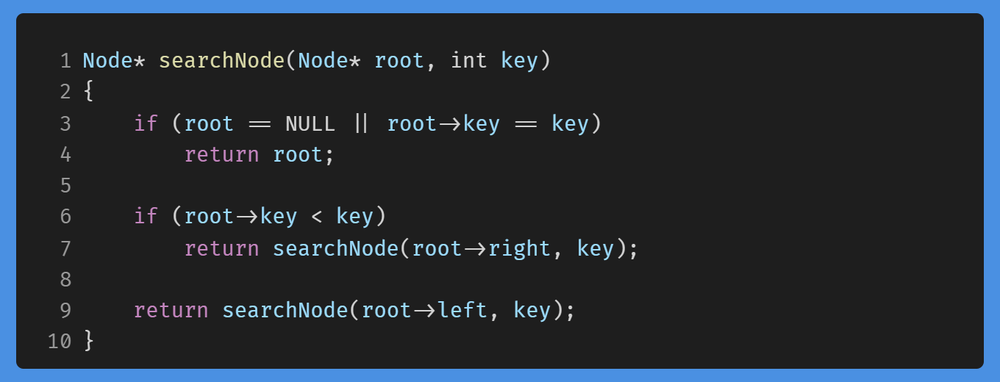

O algoritmo de busca acima é recursivo. Na linha 4, retornamos ``root``. Se ele for ``NULL``, significa que não encontramos o nó. Caso contrário, significa que ele retornará o nó com a chave (``root->key``) igual à chave (``key``) que estamos procurando.

---

# Remoção

Para a implementação da remoção, precisamos da função `getSuccessor`. Fica como exercício a sua implementação. A dica é percorrer a subárvore direita sempre pelo ramo esquerdo até não poder mais (o último nó será o sucessor).
```c
Node* getSuccessor(Node* node);
```

---

# Remoção

<!-- _class: multicolumn -->

A função `removeNode` atua de forma recursiva e aborda todos os casos estudados.

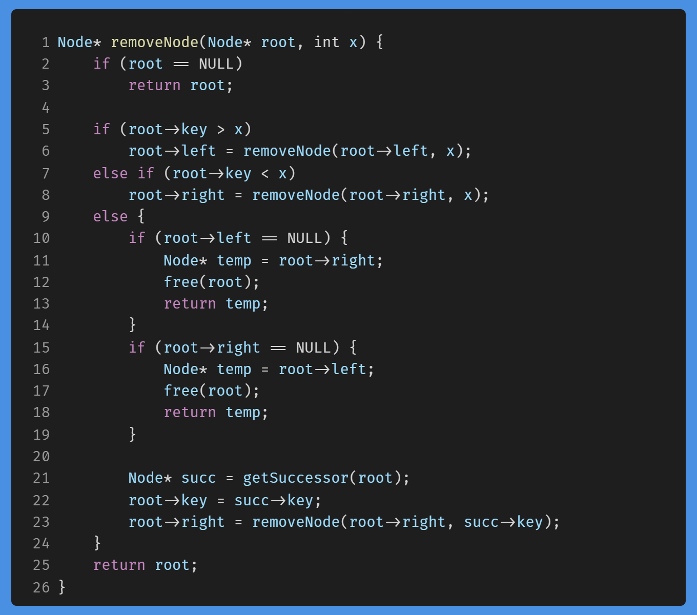

<!-- ```C
Node* removeNode(Node* root, int x) {
    if (root == NULL)
		return root;

    if (root->key > x)
        root->left = removeNode(root->left, x);
    else if (root->key < x)
        root->right = removeNode(root->right, x);
    else {
        if (root->left == NULL) {
            Node* temp = root->right;
            free(root);
            return temp;
        }
        if (root->right == NULL) {
            Node* temp = root->left;
            free(root);
            return temp;
        }
        
        Node* succ = getSuccessor(root);
        root->key = succ->key;
        root->right = removeNode(root->right, succ->key);
    }
    return root;
}
```-->

---

# Remoção

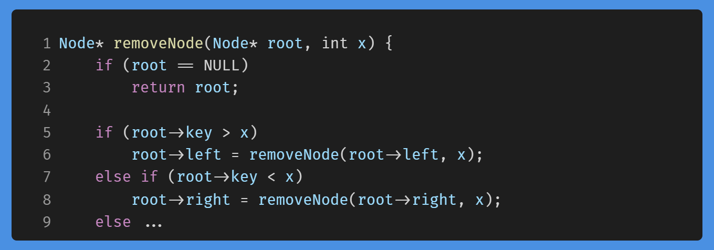


`if (root == NULL)`: Se a árvore está vazia (chegou ao fim da busca sem encontrar o nó), ela retorna `NULL`.

---

# Remoção


`if (root->key > x)`: Se a chave a ser removida é menor que a chave do nó atual, a função faz uma chamada recursiva para a **subárvore esquerda**.

---

# Remoção


`else if (root->key < x)`: Da mesma forma, se a chave é maior, a chamada recursiva é feita para a **subárvore direita**.

---

# Remoção

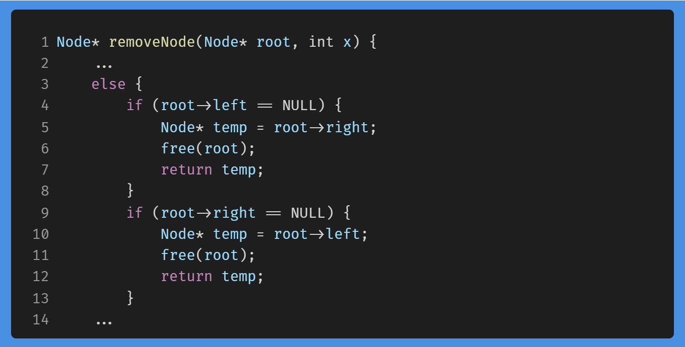

A função `removeNode` lida com o caso de zero filhos e com o caso de apenas um filho (seja o esquerdo ou o direito) de forma combinada.


---

# Remoção


Ela salva o filho em uma variável temporária, libera a memória do nó atual e retorna o ponteiro para o filho, que será conectado ao nó pai na chamada recursiva anterior.

---

# Remoção

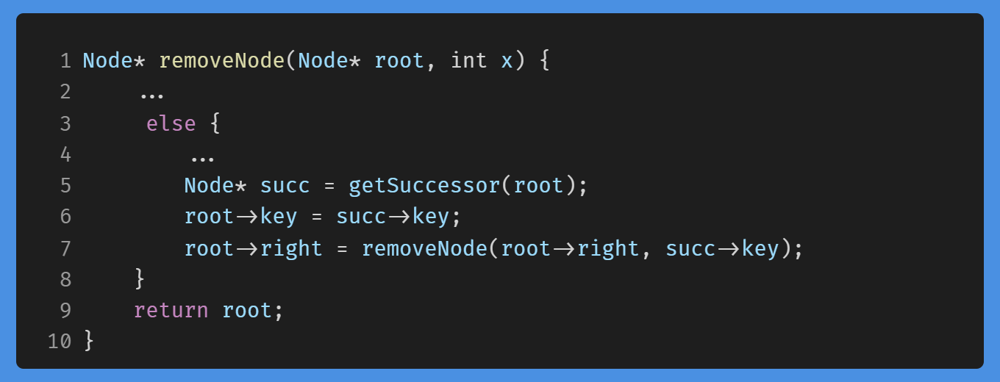

O caso de dois filhos, `removeNode` encontra o **sucessor em ordem** (`succ`), que é o menor nó da subárvore direita. Depois copia a chave do sucessor para o nó que será "removido" e faz uma chamada recursiva para remover o nó sucessor original da subárvore direita.

---

 # Observação

A nossa solução para remoção em BST realiza dois percursos pela altura da árvore quando ambos os filhos não são `NULL`. Existem otimizações dessa abordagem, mas não vamos discutir neste curso.

---

<!-- _class: chapter -->

# Complexidades

---

# Inserção 

A complexidade de tempo do pior caso para operações de inserção é de **O(h)**, onde **h** é a altura da árvore. No pior cenário, podemos ter que percorrer a árvore da raiz até o nó folha mais profundo.


A complexidade de espaço auxiliar para inserção em uma árvore de busca binária é **O(h)**, devido à pilha de chamadas recursivas.


Em vez de usar recursão, também podemos implementar a operação de inserção de forma iterativa. Desse modo, a complexidade de espaço é **O(1)**.

---

# Busca

De modo semelhante à inserção, a complexidade de tempo do pior caso para operações de busca é de **O(h)**. Já complexidade de espaço auxiliar é **O(h)**, pelo mesmo motivo.

Implementando uma versão iterativa da função de busca, iremos melhorar a complexidade de espaço auxiliar para **O(1)**.

---


# Remoção

As complexidades de tempo e de espaço auxiliar são as mesmas das operações anteriores, isto é, O(h). Da mesma forma, pode-se melhorar essa última com uma versão iterativa. 

---

# Complexidades


| Operação     | Tempo (pior) | Tempo (melhor) | Espaço Auxiliar (recursiva) | Espaço Auxiliar (iterativa) |
| :----------- | :-------------------------------- | :---------------------------------- | :------------------------------------------ | :------------------------------------------ |
| **Busca**    | O(n)                              | O(log n)                            | O(h)                                        | O(1)                                        |
| **Inserção** | O(n)                              | O(log n)                            | O(h)                                        | O(1)                                        |
| **Remoção**  | O(n)                              | O(log n)                            | O(h)                                        | O(1)                                        |

O **`n`** representa o número de nós na árvore, já o **`h`** representa a altura da árvore. No pior caso, a árvore está degenerada e a altura é igual ao número de nós. No melhor caso, a árvore está balanceada e a altura é proporcional a $\log\,n$.

---
<!-- _class: chapter -->

# Revisão e Considerações

---

# Resumo

Nesta seção, estudamos a estrutura de dados árvore binária de busca.

> - Definimos essa estrutura;
> - Realizamos as operações básicas
>   - Inserção, busca e remoção;
> - Estudamos a implementação;
> - Analisamos as complexidades das operações implementadas;

Neste momento do curso, você já tem conhecimento suficiente para resolver uma gama de exercícios. Pratique bastante.

---

 # Considerações


Nossa jornada pelas árvores binárias ainda não acabou. Um problema que ocorre com as BST é a degeneração. Para evitar isso, vamos estudar uma metodologia para deixar a árvore balanceada, evitando a complexidade de pior caso.

Nosso próximo passo será estudar as árvores **AVL** que realizam operações de rotação para rebalancear a árvore sempre que ocorre uma inserção ou remoção.

---


<!-- _class: end -->

# Obrigado

**Prof. Dr. Bruno Xavier**

Centro Multidisciplinar de Pau dos Ferros
Departamento de Engenharias e Tecnologia
Algoritmos e Estruturas de Dados 2